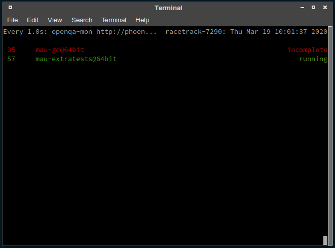

# openqa-mon

CLI monitoring client for [openQA](https://open.qa) written in plain simple go for periodic live monitoring in a terminal (See demo below)

## Build/Run

`openqa-mon` is written in plain go without any additional requirements. Build it with the provided `Makefile`

    $ make
    $ sudo make install     # install the binary to /usr/local/bin
    
    $ openqa-mon http://your-instance.suse.de/

Or simply

    $ go run openqa-mon.go http://your-instance.suse.de/

## Usage

    openqa-mon http://openqa.opensuse.org

This tool has been designed to monitor the jobs on your own instance.

### Periodical monitoring

    ## Put this in your ~/.bashrc (or whatever shell you are using)
    alias oqa-mon="watch -c -n 1 openqa-mon http://your-instance.suse.de/"

After that you simply run `oqa-mon` and you can continuously monitor the progress of your runs

## Purpose

This CLI is intended as live monitor of the state of your jobs. In contrast to the Browser interface it's smaller and probably also more efficient on the resources.

