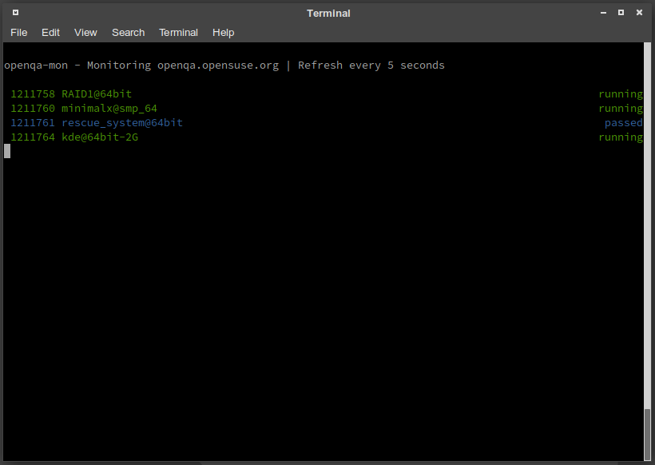

# openqa-mon

CLI monitoring client for [openQA](https://open.qa) written in plain simple go for periodic live monitoring in a terminal (See demo below)

## Build/Run

`openqa-mon` is written in plain go without any additional requirements. Build it with the provided `Makefile`

    $ make
    $ sudo make install     # install the binary to /usr/local/bin
    
    $ openqa-mon http://your-instance.suse.de/

Or simply

    $ go run openqa-mon.go http://your-instance.suse.de/

## Usage

	# Check the job overview
    openqa-mon http://openqa.opensuse.org
	# Check the status of the jobs 100,101 and 199
	openqa-mon http://openqa.opensuse.org -j 100,101,199

You can omit the `-j` parameter. Every parameter that is an `integer` will be considered as `job-id`

    openqa-mon http://openqa.opensuse.org 100 101 199

### Periodical monitoring

Preliminary native support for continuous monitoring is given with the `-c SECONDS` parameter:

    # Refresh every 5 seconds
    openqa-mon -c 5 openqa.opensuse.org

Of course this also includes continuous monitoring for certain jobs

    # Monitor job 1211758, refresh every 5 seconds
    openqa-mon -c 5 openqa.opensuse.org -j 1211758

#### Fallback method: `watch`

    ## Put this in your ~/.bashrc (or whatever shell you are using)
    alias oqa-mon="watch -c -n 1 openqa-mon http://your-instance.suse.de/"

After that you simply run `oqa-mon` and you can continuously monitor the progress of your runs:

	# Live monitor the job overview
    oqa-mon
    
    # Live monitor certain job IDs
    oqa-mon -j 4018049,4018060,4018050,4018051,4018052,4018053,4018054

## Purpose

This CLI is intended as live monitor of the state of your jobs. In contrast to the Browser interface it's smaller and probably also more efficient on the resources.

