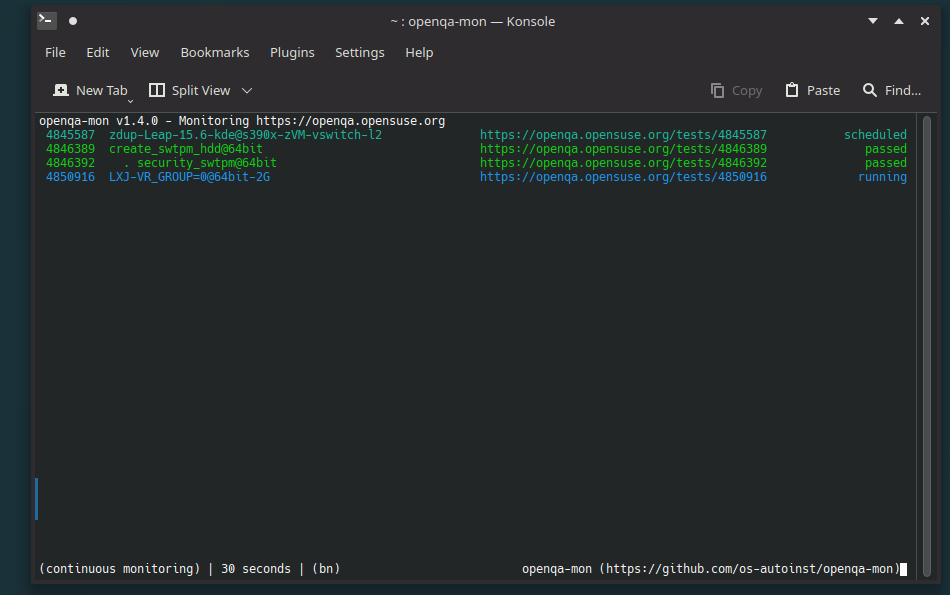

[](https://github.com/os-autoinst/openqa-mon/actions/workflows/openqa-mon.yml)

Collection of CLI monitoring tools for [openQA](https://open.qa):

* [openqa-mon](#openqa-mon) - live monitoring of openQA jobs
* [openqa-mq](#openqa-mq) - Print openQA-related [RabbitMQ](https://rabbit.opensuse.org/) messages
* [openqa-revtui](#openqa-revtui) - openQA review dashboard

Those utilities are intended as realtime monitoring tools for checking on openQA jobs.
In contrast to the browser interface they are more compact, easier on your resources and allow you to monitor multiple jobs at the same time.

## Building

`openqa-mon` is written in go with minimal requirements. The `Makefile` provides rules for installing the requirements and building the binaries.

```bash
make requirements     # manually install requirements
make
sudo make install     # install the binaries to /usr/local/bin
make install ~/bin    # install the binary to bin in your home folder
```

Static builds

```bash
CGO_ENABLED=0 make -B -j4 GOARGS="-buildmode pie"
```

or

```bash
make static
```

# `openqa-mon`



## Usage

```
Usage: openqa-mon [OPTIONS] REMOTE
  REMOTE can be the directlink to a test (e.g. https://openqa.opensuse.org/t123)
  or a job range (e.g. https://openqa.opensuse.org/t123..125 or https://openqa.opensuse.org/t123+2)

OPTIONS

  -h, --help                       Print this help message
  --version                        Display program version
  -j, --jobs JOBS                  Display information only for the given JOBS
                                   JOBS can be a single job id, a comma separated list (e.g. 42,43,1337)
                                   or a job range (1335..1339 or 1335+4)
  -c,--continuous SECONDS          Continuously display stats, use rabbitmq if available otherwise status pulling
  -e,--exit                        Exit openqa-mon when all jobs are done (only in continuous mode)
                                   Return code is 0 if all jobs are passed or softfailing, 1 otherwise.
  -b,--bell                        Bell notification on job status changes
  -n,--notify                      Send desktop notifications on job status changes
  --no-bell                        Disable bell notification
  --no-notify                      Disable desktop notifications
  -m,--monitor                     Enable bell and desktop notifications
  -s,--silent                      Disable bell and desktop notifications

  -f,--follow                      Follow jobs, i.e. replace jobs by their clones if available
  --no-follow                      Don't follow jobs
  --rabbitmq                       Explicitly enable rabbitmq (experimental!!)
  --rabbit FILE                    Explicitly enable rabbitmq and load configurations from FILE
  --no-rabbit                      Don't use RabbitMQ, even if available
  -p,--hierarchy                   Show job hierarchy (i.e. children jobs)
  --hide-state STATES              Hide jobs with that are in the given state (e.g. 'running,assigned')

  --config FILE                    Read additional config file FILE
  -i, --input FILE                 Read jobs from FILE (additionally to stdin)
  ```

### Examples

```
# Check the job overview
openqa-mon http://openqa.opensuse.org

# Check the status of the jobs 100,101 and 199
openqa-mon http://openqa.opensuse.org -j 100,101,199

# Continuous monitoring certain jobs (e.g. job 401558 and 401782)
openqa-mon -c 5 http://your-instance.suse.de 401558 401782

# Continuous monitoring job range (e.g. jobs 202-205, i.e. jobs 202,203,204,205)
openqa-mon -c 5 http://your-instance.suse.de 202..205
openqa-mon -c 5 http://your-instance.suse.de 202+3

# Continuous monitoring with all notifications and job hierarchy (show children)
openqa-mon -mfpc 2 http://your-instance.suse.de 413
```

You can omit the `-j` parameter. Every positive, non-zero integer will be considered as `job-id`.

```
openqa-mon http://openqa.opensuse.org 100 101 199
```

## Config file

`openqa-mon` reads configuration options from `/etc/openqa/openqa-mon.conf` (global config) and from `~/.openqa-mon.conf` (user config).
See [openqa-mon.conf](openqa-mon.conf) for an example configuration file.

Note that setting `DefaultRemote`, the tools will use this for defined job IDs or for displaying the job overview without specifying `REMOTE` as parameter.

## RabbitMQ

Since version 0.7.0, `openqa-mon` has experimental RabbitMQ support. When monitoring jobs from a host with a configured RabbitMQ server, `openqa-mon` will subscribe to the RabbitMQ and listen for job updates there instead of pulling job updates from the instance itself. This feature is by default disabled, unless activated via `--rabbitmq` or via the `RabbitMQ = true` setting in `~/.openqa-mon.conf`.

For RabbitMQ usage, matching RabbitMQ servers need to be configured in one of the following files:

* `/etc/openqa/openqamon-rabbitmq.conf` (recommended for system-wide configurations, e.g. OSD and O3)
* `~/.config/openqa/openqamon-rabbitmq.conf` (recommended for custom configurations, e.g. your own openQA instance)

Alternatively, a custom file can be used using the `--rabbit FILE` program argument.

A RabbitMQ configuration file is a ini-style file. See [rabbitmq.conf.example](rabbitmq.conf.example).

When RabbitMQ is enabled, `openqa-mon` will connect to all configured hosts. If all defined jobs have a corresponding RabbitMQ server, then the continuous monitoring will be paused to avoid pulling. If at least one job has no corresponding RabbitMQ server configured, then polling will be still enabled.

# `openqa-mq`

`openqa-mq` connects to the given RabbitMQ server and prints all received messages.

## Usage

    openqa-mq ooo           # Monitor the openSUSE RabbitMQ
    openqa-mq osd           # Monitor the SUSE internal openQA instance

# `openqa-revtui`

## Usage

    openqa-revtui [OPTIONS] [FLAVORS]
    openqa-revtui -c config.toml

`openqa-revtui` is a terminal user interface for helping the user to review the jobs of whole job groups. The typical usage is to run `openqa-revtui` with a predefined configuration toml file. The configuration file defines the remote openQA instance to monitor, job groups and additional query parameters, as well as settings to hide jobs that are not interesting for you (e.g. passing jobs).


You find a set of example configurations in the [review](_review) subfolder.
