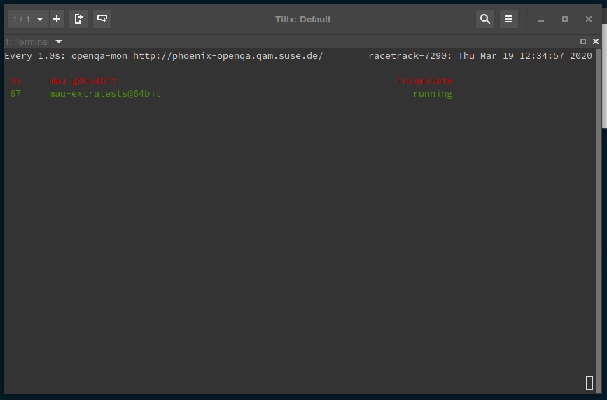
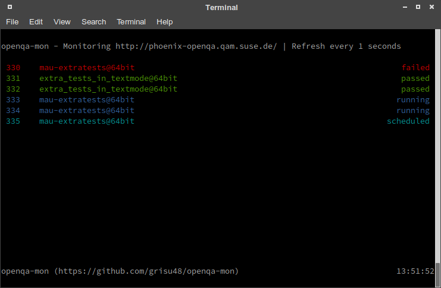

# openqa-mon

Simple CLI monitoring utilities for [openQA](https://open.qa).
This project now consists of three programs:

* `openqa-mon` - live monitoring of openQA jobs
* `openqa-mq` - Query [RabbitMQ instance](https://rabbit.opensuse.org/) for updates
* `openqa-revtui` - (Experimental) openQA review dashboard

Those utilities are intended as live monitor tool for your jobs. In contrast to the Browser interface they are smaller, more efficient on the resources and should make your life easier :-)

## Building

`openqa-mon` is written in go with some minimal requirements. The `Makefile` provides rules for installing the requirements and building the binaries.

    make requirements     # manually install requirements
	make
    sudo make install     # install the binaries to /usr/local/bin
    make install ~/bib    # install the binary to bin in your home folder

Static builds

     CGO_ENABLED=0 make -B -j4 GOARGS="-buildmode pie"

# `openqa-mon`

## Usage

    SYNOPSIS:
    openqa-mon [OPTIONS] REMOTE [JOBS]
    
      REMOTE - openQA base URL
      JOBS can be: either a single job id, multiple comma separated job ids or a job id range (MIN..MAX or START+INDEX)
                   See examples below for examples
    OPTIONS
      -c N             Periodic monitoring, refresh every N seconds
      -h, --help       Print help message
      
      -b, --bell       Bell notification on job status change
      -n, --notify     Desktop notification on job status change
      -m,--monitor     Enable all notifications
      --no-bell        Disable bell notifications
      --no-notify      Disable desktop notifications
      -s,--silent      Disable all notifications
      
      -f, --follow     Follow jobs, i.e. replace jobs by their clones if available
      -p, --hierarchy  Show job's children as well (job hierarchy)
      
      --config FILE    Set config file

#### Examples

	# Check the job overview
    openqa-mon http://openqa.opensuse.org
    
	# Check the status of the jobs 100,101 and 199
	openqa-mon http://openqa.opensuse.org -j 100,101,199
	
    # Continuous monitoring certain jobs (e.g. job 401558 and 401782)
    openqa-mon -c 5 http://your-instance.suse.de 401558 401782
	
    # Continuous monitoring job range (e.g. jobs 202-205, i.e. jobs 202,203,204,205)
    openqa-mon -c 5 http://your-instance.suse.de 202..205
    openqa-mon -c 5 http://your-instance.suse.de 202+3
    
    # Continuous monitoring with all notifications and job hierarchy (show children)
    openqa-mon -mfpc 2 http://your-instance.suse.de 413

You can omit the `-j` parameter. Every positive, non-zero `integer` parameter will be considered as `job-id` to be monitored

    openqa-mon http://openqa.opensuse.org 100 101 199

### Periodical monitoring

Support for continuous monitoring is given with the `-c SECONDS` parameter:

    # Refresh every 5 seconds
    openqa-mon -c 5 openqa.opensuse.org

Of course this also includes continuous monitoring for certain jobs

    # Monitor job 1211758, refresh every 5 seconds
    openqa-mon -c 5 openqa.opensuse.org -j 1211758

## Config file

`openqa-mon` reads default configuration from `/etc/openqa/openqa-mon.conf` (global config) or in  `~/.openqa-mon.conf` (user config). Copy and modify the example configuration file [openqa-mon.conf](openqa-mon.conf) to `~/.openqa-mon.conf`

	## openqa-mon config file
	## 
	## this is an example config file for openqa-mon. Modify and place this file in
	## /etc/openqa/openqa-mon.conf (global) or in ~/.openqa-mon.conf (user config)
	## 
	## Have a lot of fun ...
	
	
	## Default remote to use, if nothing is defined
	# DefaultRemote = http://openqa.opensuse.org
	## Enable bell notifications
	# Bell = true
	## Enable desktop notifications
	# Notification = true
	## Follow jobs
	# Follow = true

If you comment out and set `DefaultRemote`, the tool will use this for defined job IDs or for displaying the job overview without specifying `REMOTE` as parameter.

* * *

# `openqa-mq`

## Usage

    openqa-mq ooo           # Monitor the openSUSE RabbitMQ
    openqa-mq osd           # Monitor the SUSE internal openQA instance

`openqa-mq` connects to the given RabbitMQ server and prints all received messages. It might be useful to grep for status updates of certain jobs or whatever else you want to monitor.