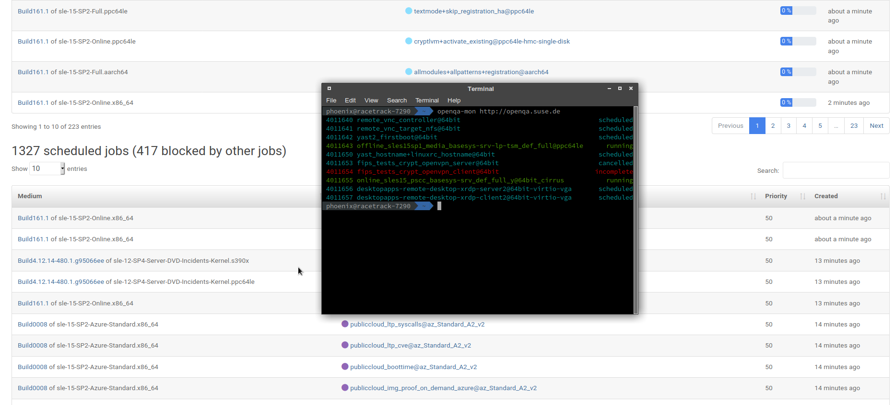

# openqa-mon

CLI monitoring client for OpenQA written in plain simple go

    make
    sudo make install     # install the binary to /usr/local/bin
    
    openqa-mon http://your-instance.qam.suse.de/

Or simply

    go run openqa-mon.go http://your-instance.qam.suse.de/

## Usage

    openqa-mon URL
      URL is the openqa instance URL, e.g. openqa-mon http://your-instance.qam.suse.de/

Running against the main instance takes forever and is **NOT** recommended (too many jobs!). Please only use your own instance

### Periodically monitoring

    ## Put this in your ~/.bashrc
    alias oqa-mon="watch -c -n 1 openqa-mon http://your-instance.qam.suse.de/"

After that you simply run `oqa-mon` and you can continuously monitor the progress of your runs

